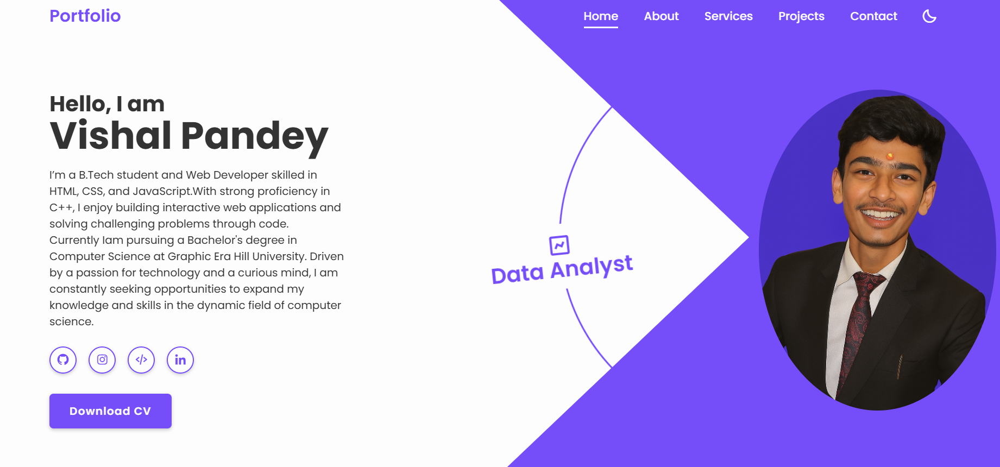

# Vishal-portfolio# 🌐 Personal Portfolio Website  

> A responsive and modern portfolio website built using **HTML**, **CSS**, and **JavaScript** to showcase my skills, education, and projects.  

---

## ✨ Highlights  

- 🎨 **Modern UI/UX** – Sleek design with hover effects and smooth animations.  
- 📱 **Fully Responsive** – Optimized for desktop, tablet, and mobile.  
- 🧑‍💻 **About Me Section** – Quick intro and background.  
- 📂 **Projects Showcase** – Highlights of my key work.  
- 🎓 **Certificates Section** – Academic background neatly presented.  

---

## 🛠️ Tech Stack  

  
  
  

---

## 📸 Preview   

 

---

## ⚡ How It Works  

1. 🏗️ **HTML5** provides the structure.  
2. 🎨 **CSS3** powers the styling, animations, and responsive layout.  
3. ⚙️ **JavaScript** adds interactivity and dynamic features.  

---

